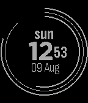
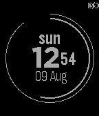
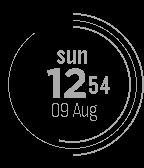
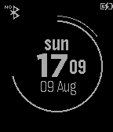
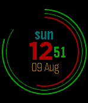
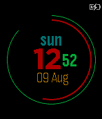
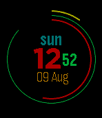
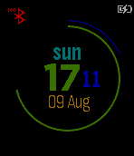

# Color Polar Clock for Pebble Time

Color watchface for pebble SDK 3.0

Inspired by [pixelbreaker's polarclock](http://blog.pixelbreaker.com/polarclock), [nirajsanghvi's pebble polar clock](https://github.com/nirajsanghvi/pebble) and [Jnmattern's Arc](https://github.com/Jnmattern/Arc).

Features
--------
* Displays the hour and minutes as a colored (only on pebble time) arc that increases as the time passes
* Displays charging state as an icon in the top right part of the screen
* Displays day of the week
* Displays date with day and month
* When the bluetooth connection is severed, display a little "no bluetooth" symbol at the top left part of the screen

Planned
-------
* More languages for the day of the week and month name

Screenshots Aplite (Pebble and Pebble Steel)
-----------

Screenshots Basalt (Pebble Time and Pebble Time Steel)
-----------

